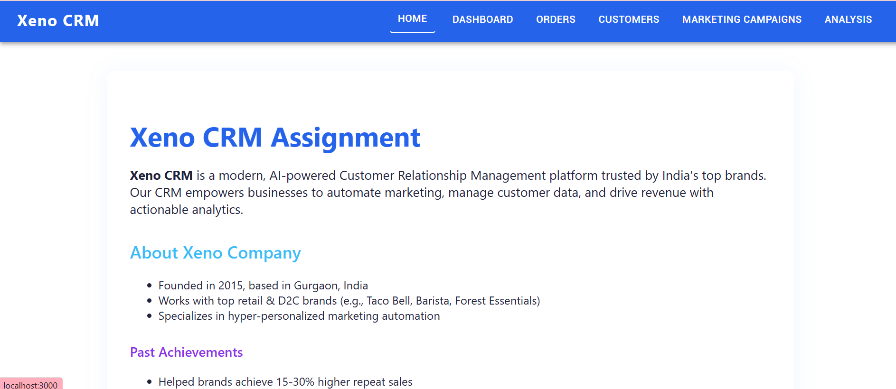
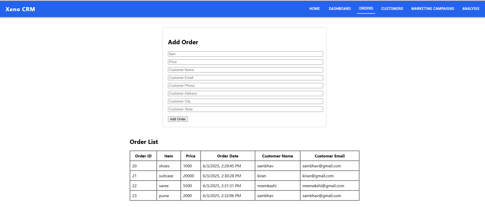
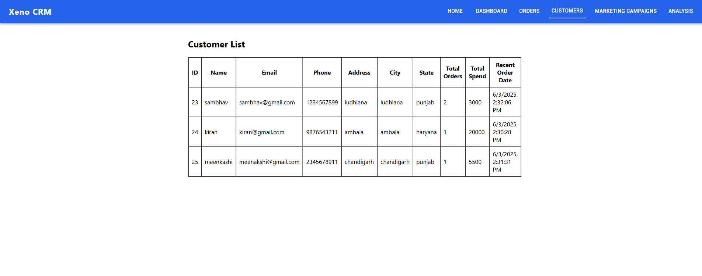
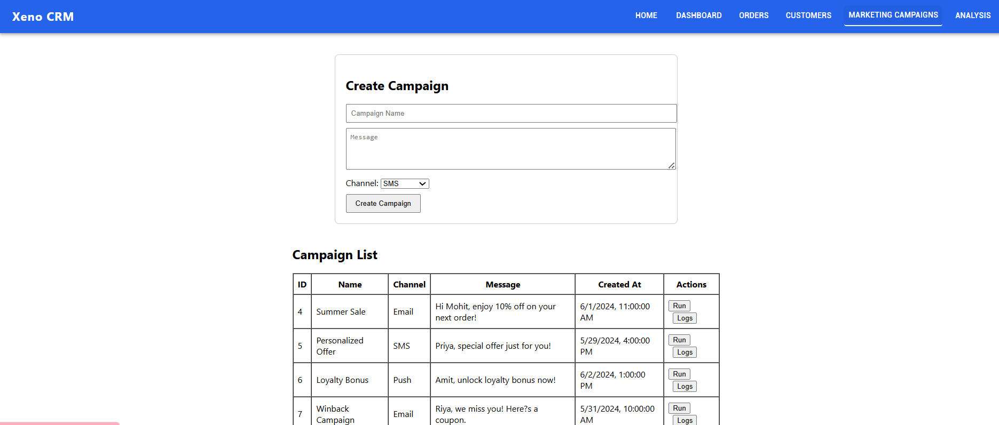
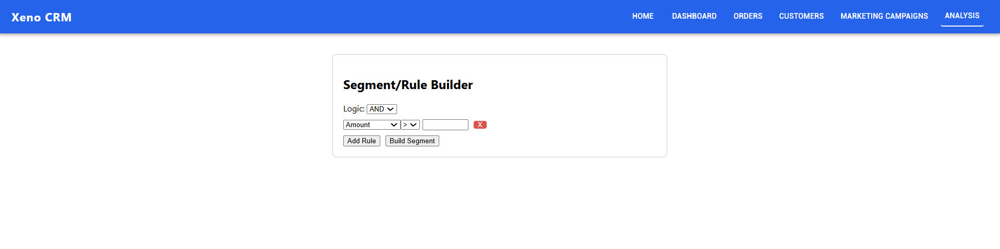

# 🚀 Xeno CRM Fullstack Application

A modern, scalable CRM platform built with **React (frontend)** and **Spring Boot (backend)**.

---

## 📁 Project Structure

CRM-Project/
│
├── xeno-crm-frontend/ # React frontend
│ ├── public/
│ ├── src/
│ │ ├── components/
│ │ ├── App.js
│ │ └── index.js
│ ├── package.json
│ └── ...
│
├── CRM-backend/ # Spring Boot backend
│ ├── src/
│ │ └── main/
│ │ ├── java/
│ │ │ └── ... (controllers, services, models)
│ │ └── resources/
│ │ ├── static/ # React build files for production
│ │ └── application.properties
│ ├── pom.xml
│ ├── mvnw
│ ├── mvnw.cmd
│ └── ...
│
├── README.md
└── ...

---

## ✨ Features

- **Customer & Order Data Ingestion** (REST APIs with validation)
- **Campaign Creation UI** (AND/OR rule builder, clean UX)
- **Campaign List** (View all past campaigns)
- **Simulated Campaign Delivery** (90% SENT, 10% FAILED)
- **Deployed Demo** (see below!)

## ✨ Ongoing Developments 

**Google OAuth 2.0 Login** (only authenticated users can access)
**Campaign Analytics** (track campaign performance)
**Campaign Scheduling** (schedule campaigns for future dates)
**Campaign Reporting** (generate reports on campaign performance)
**campaign AI Integeration**(automatically send campaigns based on customer behavior)

---

## 🛠️ Tech Stack & Key Dependencies

### **Frontend (React)**
- `react` 18.2.0
- `react-dom` 18.2.0
- `react-router-dom` 6.22.3
- `@mui/material` 5.14.0
- `@mui/icons-material` 5.14.0
- `framer-motion` 6.5.1
- `axios` 1.6.2
- `web-vitals` 3.0.4

### **Backend (Spring Boot)**
- Java 17
- Spring Boot 3.x
- Spring Web, Spring Security (Google OAuth)
- Maven (with wrapper)
- H2/MySQL (as per config)

---

## 🌐 Deployment

| Service   | URL (Example)                                              |
|-----------|------------------------------------------------------------|
| **Frontend**  | [https://crm-fullstack-lac.vercel.app/](https://crm-fullstack-lac.vercel.app/) |

---

## 🚀 Getting Started

### **Frontend Setup**

- git clone https://github.com/sambhav230/CRM-fullstackyeh.git
- cd xeno-crm-frontend
- npm install
- npm start
- Open https://crm-fullstack-lac.vercel.app/ to view it

### **Backend Setup**

- cd ../CRM-backend
- ./mvnw clean package
- java -jar target/*.jar

> **Ensure** `application.properties` contains:  
> `server.port=${PORT:8080}`  
> for cloud deployment compatibility.

---

## 📋 API Endpoints (Examples)

| Endpoint           | Method | Description                  |
|--------------------|--------|------------------------------|
| `/api/customers`   | POST   | Ingest customer data         |
| `/api/orders`      | POST   | Ingest order data            |
| `/api/campaigns`   | POST   | Create new campaign          |
| `/api/campaigns`   | GET    | List all campaigns           |
| `/api/auth/google` | GET    | Google OAuth login           |

> **See full API docs in backend code or Swagger UI (if enabled).**

---

## 📸 Screenshots

---

## 🎥 Demo Video

[👉 **Watch the Demo Video here**](#)  
*Paste your YouTube or Google Drive video link above.*

---

## 📝 Features Checklist

- [x] Secure REST APIs for data ingestion
- [x] Campaign creation UI with flexible rules
- [x] Campaign listing (latest first)
- [x] Simulated delivery (90% sent, 10% failed)
- [x] Google OAuth 2.0 authentication
- [x] Deployed on cloud (frontend & backend)
- [x] Clean code, modular structure
- [x] README with setup & usage instructions

---

## 🧑‍💻 Contributing

Pull requests are welcome!  
For major changes, please open an issue first to discuss what you would like to change.

---

## 📄 License

[MIT](LICENSE)

---

> **Made with ❤️ by Sambhav Kapoor for Xeno SDE Internship Assignment**

